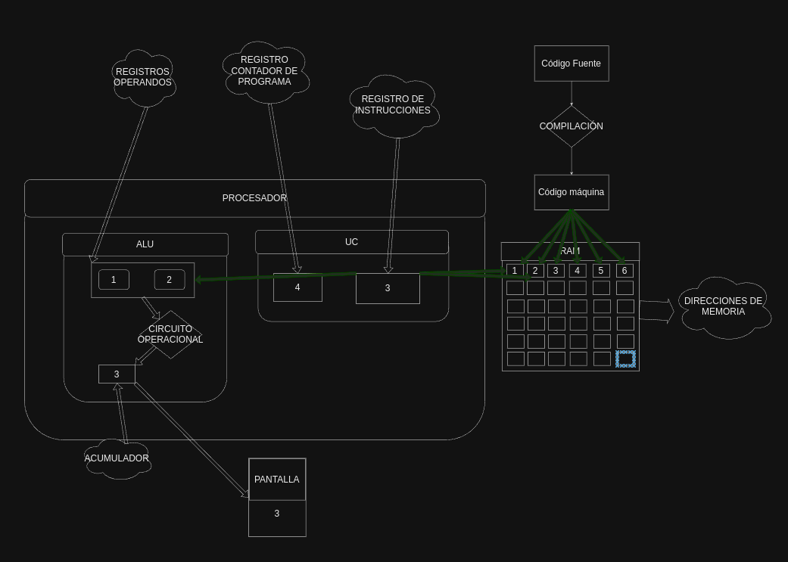
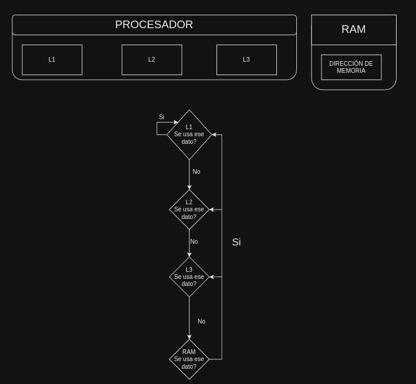
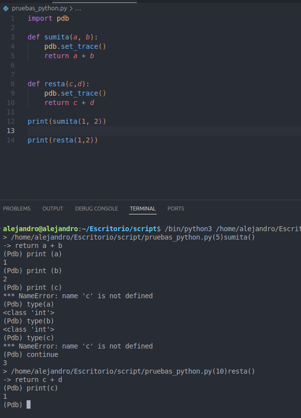
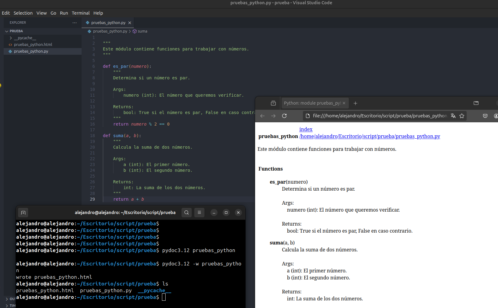

[](https://classroom.github.com/a/Z6NE2ogx)
[](https://classroom.github.com/online_ide?assignment_repo_id=16536745&assignment_repo_type=AssignmentRepo)
# Práctica 1: Introducción al desarrollo. Reflexiones.

Apoyate en los siguientes recursos para realizar la práctica:

[Descripción de la práctica](https://revilofe.github.io/section3/u01/practica/EDES-U1.-Practica010/)


---

# Título de la Actividad

## Identificación de la Actividad
- **ID de la Actividad:** 530151
- **Módulo:** PROG
- **Unidad de Trabajo:** 1.1 Reflexiones
- **Fecha de Creación:** 13/10/2024
- **Fecha de Entrega:** 15/10/2024
- **Alumno(s):**
  - **Nombre y Apellidos:** Alejandro Bravo Calderón
  - **Correo electrónico:** abracal@g.educaand.es
  - **Iniciales del Alumno/Grupo:** ABC

## Descripción de la Actividad
[Descripción detallada de la actividad, objetivos, y contexto necesario para comprenderla. Explicar en qué 
consiste la actividad y qué se espera que el alumno desarrolle o implemente.]

## Instrucciones de Compilación y Ejecución
1. **Requisitos Previos:**
   -  Python3 y pydoc

2. **Pasos para Compilar el Código:**
   ``` No hay
   [Comando para compilar el código]
   ```

3. **Pasos para Ejecutar el Código:**
   ```pydoc <archivo>
   [Comando para ejecutar la aplicación]
   ```

4. **Ejecución de Pruebas:**
   ```No hay
   [Comandos para ejecutar pruebas, si las hubiera]
   ```

## Desarrollo de la Actividad
### Descripción del Desarrollo
Se ha realizado la actividad abordando el temario complementario de esta unidad.
### Código Fuente
[Aquí se incluirá un enlace directo a los archivos de código fuente en el repositorio, por ejemplo, si se está usando GitHub: `src/main.java` o algún enlace directo.]

### Ejemplos de Ejecución
- **Entrada 1:**
```
Help on module pruebas_python:

NAME
    pruebas_python - Este módulo contiene funciones para trabajar con números.

FUNCTIONS
    es_par(numero)
        Determina si un número es par.

        Args:
            numero (int): El número que queremos verificar.

        Returns:
            bool: True si el número es par, False en caso contrario.

    suma(a, b)
        Calcula la suma de dos números.

        Args:
            a (int): El primer número.
            b (int): El segundo número.

        Returns:
```
- **Salida Esperada 1:** El resultado de la salida es un documento el cual te va a explicar línea a línea lo que hace cada parte del código.

### Resultados de Pruebas
La verificicación del código se ha usado pgd que sirve para testear que tu código funcione correctamente pero 
con la funcionalidad de parar el código en un momento de su ejecución y poder comprobar los valores usados anteriormente.
## Documentación Adicional
- **Manual de Usuario:** https://github.com/IES-Rafael-Alberti/2425-u1-1-1-reflexiones-Alejandro-Bravo2
- **Autorización de Permisos:** Verificar que el profesor tenga permisos de lectura en el repositorio para revisar el código.

## Conclusiones
He aprendido el comportamiento de un proceso cuando se ejecuta, tambíen las distintas herramientas que 
existen y además entender el funcionamiento de un compilador e interprete.
## Referencias y Fuentes
De este video aprendi sobre los semgnetos de la ram
https://www.youtube.com/watch?v=C06r6DfCxpA
De este video aprendi como se ejecuta un proceso en el procesador
https://www.youtube.com/watch?v=-URf73z9tKY
### Notas Adicionales:
1. **Nombres de Archivos y Repositorios:**
   - Asegúrate de que el nombre del archivo o repositorio siga la estructura definida: `XXX-idActividad-Iniciales`.
2. **Permisos:**
   - Verifica que el profesor tenga los permisos necesarios para acceder al repositorio o documento.
3. **Formato:**
   - Si se entrega en formato PDF o Google Docs, asegúrate de cumplir con el mínimo y máximo de folios establecidos.
4. **Compilación y Ejecución:**
   - Detalla claramente cómo compilar y ejecutar el código, incluyendo las instrucciones en el archivo `README.md`.

# Práctica 1.10: Preguntas sobre actividades
## P 1.10: Reflexión y discusión sobre los resultados
### 1. Relación software y hardware
##### 1.1. Primera parte
**1.1.1. ¿Cómo se ejecuta el código en el procesador?**
El código es compilado al lenguaje máquina pero antes realiza una comprobación de este para comprobar que no haya fallos en la sintaxis.
El código ejecutable se ejecuta y cada parte del código se almacena en una dirección de memoria .
Cuando se lea esa celda se usarán los datos correspondientes para realizar la operación en los registros operandos. 
Además aumentará en  1 el registro contador de programa que se encuentra en la UC (unidad de control).
El registro de instrucciones guardará la dirección de la dirección de memoria que se está ejecutando.
A continuación la alu realizará la operación y la guardará en el registro acumulador. 
La unidad de control se encargará de que todas las operaciones realizadas estén correctas además también es
 el encargado de la comunicación entre la alu y la memoria principal y el resto de componentes.
Cada vez que se deba mostrar algo en el dispositivo de salida lo hará la cpu interactuando con sus drivers
 de esos dispositivos de salida a través de los buses que se usan para pasar la información por la placa base.
Representación gráfica del orden de ejecución de un programa



**DATO IMPORTANTE:**
El procesador tiene 3 niveles en su caché:
Estos niveles representan la cercanía a los núcleos del procesador.
L1: En este nivel se almacenarán los datos de forma temporal que se usan de forma constante.
L2: En este nivel se almacenarán los datos de forma temporal  que son consultados de forma frecuente.
L3: En este nivel se almacenarán los datos de forma temporal  que son consultados rara vez pero siempre se consultan.

Razonamiento:
He explicado esto porque cuando se ejecuta un programa (conjunto de código) el programa no va a estar siempre 
cargado en la caché por lo que era necesario explicar esto para que se sepa realmente lo que pasa también 
con ese programa a lo largo del tiempo.

Explicación del algoritmo de envejecimiento:
Algoritmo por envejecimiento: Todos los datos se pasan a L1 y se esperan x ciclos y si ese dato no ha sido reutilizado
 en esos x ciclos no se ha usado pues lo pasamos a l2 y asín se hace denuevo y si no se usa pues se pasa a l3 y se vuelve a repetir y 
 si no se usa pues se pasa a memoria ram. Una cosa a tener en cuenta es que los datos no se llevan directamente al nivel superior en 
 caso de ser usados si no que interactúan otros factores como por el ejemplo el tamaño del bloque o si la caché está llena o no 
 pero por regla general vamos a tomar este ejemplo que he dado.


Explicación gráfica de la explicación de la jerarquía de la caché:



**1.1.2. ¿Qué hace la memoria RAM con la información del botón o el LED?**
La ram simplemente guarda la información del estado de ambos, el que se encarga de interactuar con esos valores es el procesador.

**1.1.3. ¿Cómo se comunican los periféricos (botón y LED) con el procesador?**
Cada uno tendrá un valor booleano (0 y 1) este valor es guardado en la ram. Imaginemos que el botón lo que hace es 
encender y apagar el led pues lo que haría el procesador es una vez que se ha mandado la información de entrada del
 botón (dato importante: los dispositivos de entrada cuando se usan tiene prioridad en cuanto a procesos por lo que
  el procesador los ejecutará lo antes posible) lo que hará el procesador es revisar el valor guardado del led en la ram 
  y si es encender pues cambiará ese valor a 1 y si es apagar lo cambiará a 0.

#### 1.2. Segunda parte
**1.2.1. ¿Cómo interactúan el procesador, la memoria y los periféricos en la ejecución del programa?**
Memoria ram: Actúa como almacén de datos temporales.
Procesador: Es el encargado de las operaciones lógicas, la interacción entre los datos y el encargado del contador de programa.
Periféricos: Mandarán los datos recibidos por el dispositivo de entrada al procesador y en caso de ser dispositivo de salida,
 el procesador será el que mande los datos para que se muestren en el dispositivo de salida.

**1.2.2. ¿Qué pasa con los datos en la memoria cuando el programa se ejecuta?**

El programa el cual estaba almacenado en la memoria secundaria pasa a la memoria principal y la cpu va ejecutando las instrucciones una por una.

**1.2.3. ¿Qué roles juegan las instrucciones del software en esta interacción?**
Las instrucciones son básicamente el código ejecutable que procesará el procesador por lo que las instrucciones 
tendrían un rol como si fueran leyes o normas a seguir.

**1.2.4. ¿Cómo se relaciona esta simulación con lo que ocurre en un ordenador real?**
Cuando ejecutamos algo primeros hacemos doble click sobre algo o ejecutamos por terminal por lo que eso 
provocaría unos datos numéricos en ASCII guardados en la ram pero con una prioridad,el procesador leería esos
 datos numéricos y le asignaría un espacio en la memoria ram a ese programa, luego el procesador movería de
  la memoria secundaria a la memoria principal el programa, el procesador interactúa con las instrucciones 
  guardadas en ese programa llevándolas a cada segmento reservado del espacio asignado por el procesador:
Segmentos:
-Segmento de texto: se guarda todo el código ejecutable del programa. SOLO LECTURA
-Segmento de datos: se guarda las variables globales y estáticas que son inicializadas pro el programa.
-Segmento de datos no inicializados: se guardan las variables estáticas y globales que no son inicializadas por el programa pero si son declaradas en el programa
-Segmento heap: provee un espacio para la asignación dinámica de la memoria mientras está el programa en ejecución.
-Segmento de pila: contiene las variables globales definidas pero dentro de las funciones.

Entre el segmento de heap y el segmento de pila hay un espacio asignado para que en caso de que un segmento necesite más espacio pueda ser usado. 

Cada instrucción se guarda en una celda distinta la cual es identificada por un número.

El procesador aumentará el contador de programa por cada celda ejecutada.

La ALU (Unidad aritmética lógica) realiza las operaciones matemáticas necesarias de cada parte del código que es traída 
de cada celda y ese valor es llevado al acumulador que irá actualizando su valor.
El acumulador incrementará su valor en función de las operaciones realizadas.
La unidad de control se encargará de que todas las operaciones realizadas estén correctas.
Cada vez que se deba mostrar algo en el dispositivo de salida lo hará la cpu interactúa con el hardware a través de sus 
drivers para poder mandar el mensaje al dispositivo de salida.

Un dato importante es que si alguna parte de un proceso en casó de estar en un estado de bloqueo o suspendido se
 pasará a la memoria virtual (mecanismo que permite almacenar datos de forma temporal en las unidades de discos duros, inconveniente: es muy lenta)

#### 2. Del código fuente al ejecutable
**2.1. ¿Cómo se diferencia el código fuente del código objeto y del ejecutable?**
DIferencia:
Código fuente: Es el código escrito por el humano, entendible para el humano pero no entendible para la máquina.
Código objeto: Es el código compilado a partir del código fuente. Contiene todas las instrucciones traducidas.
Código ejecutable: Tiene todas las instrucciones en lenguaje máquina, por lo que puede ser ejecutado por el sistema.
**2.2. ¿Por qué el ordenador no puede entender el código fuente directamente?**
Porque el código fuente no es un lenguaje entendible por el ordenador ya que el ordenador solo entiende 0 y 1 y en código fuente se usan sintaxis, palabras, etc.
**2.3. ¿Por qué es importante el paso de enlazado en la creación de programas?**
Porque es el que se encarga de la creación del archivo ejecutable. Lo que significa es que adjunta todos los ficheros de código objeto en un solo fichero.
**2.4. ¿Qué ocurre si falta alguna de las etapas (código objeto o ejecutable)?**
Si falta el código objeto pues el ordenador no va a poder ejecutar ese código ya que no está enlazado. 
Si falta el ejecutable pues faltaría el paso más importante ya que aunque tengamos todos los ficheros preparados, no lo vamos a poder ejecutar.
#### 3. Generación de código intermedio
**3.1. ¿Cómo difiere el código intermedio del código ejecutable tradicional?**
La principal diferencia es su portabilidad, el código ejecutable tradicional sólo podrá ser usado en ese sistema operativo en concreto.
La ejecución del código ejecutable tradicional es ejecutable directamente mientras que el código intermedio necesita intérprete o máquina virtual.
**3.2. ¿Por qué es útil tener una máquina virtual?**
Porque permite adaptar el código intermedio a cada hardware específico de esta forma es mucho más flexible.

**3.3. ¿Qué ventajas ofrece el código intermedio?**
La principal es la portabilidad ya que permite ejecutar el mismo código en diferentes sistemas operativos.
Seguridad: permite realizar comprobaciones y controlar el acceso del código intermedio al sistema operativo. 
Un ejemplo claro de esto es la vulnerabilidad buffer overflow, esta vulnerabilidad no se podría hacer si hay de por
 medio una máquina virtual o al menos dificultará realizar ese ataque.
Optimización en tiempo de ejecución: Algunas máquinas virtuales convierten el código intermedio en código máquina 
justo antes de que sea ejecutado por lo que optimiza el rendimiento del programa.

**3.4. ¿Además de java, qué otros lenguajes usan máquinas virtuales?**
Kotlin, ruby, scala.

#### 4. Lenguajes de programación
**4.1. Primera parte**
**Compara el proceso de ejecución entre el lenguaje compilado y el interpretado.**
**4.1.1. ¿Qué diferencias notaron en el proceso de compilación frente a la ejecución directa?**
La principal diferencia es que tienes que pasar todo tu código fuente al código máquina usando el compilador además 
de que cuando lo compilas te dirá si tiene algún fallo o no tu código mientras que en el lenguaje intérprete cuando lo 
ejecutas la forma de su lectura va a ser línea por línea por lo que no sabrás si hay un error en alguna parte del código a 
no ser que cuando lo estés probando llegues a esa parte.
**4.1.2. ¿Qué pasa si hay un error de sintaxis en cada lenguaje? ¿Cuándo se detecta el error?**
En el lenguaje compilado se detectaría dicho error al momento de la compilación mientras que en el
 lenguaje interpretado lo detectaremos una vez lo estemos ejecutando,
#### 4.2. Segunda parte
**Compara un lenguaje de alto nivel con uno de bajo nivel.**
**4.2.1. ¿Qué notaron sobre la abstracción entre los lenguajes de alto nivel y bajo nivel?**
Que en el bajo nivel tienes que encargarte de partes importantes como la asignación de celdas y la interacción del hardware,
 mientras que en el de alto nivel el usuario solo se limita a entender su código pero no controla su código a nivel hardware.
**4.2.2. ¿Qué ventajas y desventajas encontraron en cada uno?**
Bajo nivel:
-Ventaja: Permite un mayor rendimiento en los programas, mayor eficiencia de los recursos y control total del hardware.
-Desventaja: Complejo de hacer
Alto nivel:
	-Ventaja: Permite hacer programas de forma general en respecto al hardware ya que no interactúan con él, más fácil de hacer y más legible para el humano.
	-Desventaja: No control sobre el hardware, menor eficiencia de los recursos hardware.
#### 4.3. Tercera parte
**Compara un lenguaje orientado a objetos vs funcional.**
**4.3.1. ¿Cómo funciona la organización de datos en Java usando objetos y métodos?**

En java los objetos tienen: 
-Atributos Características de cada objeto.
-Métodos: La acción que hace cada objeto.
**4.3.2. ¿Cómo es diferente trabajar en un enfoque funcional en Python, usando solo funciones puras?**
La diferencia es que en la programación funcional se usan funciones para simplificar el código y reducirlo y las variables no tienen características únicas.
#### 4.4. Reflexión final

**4.4.1. ¿Qué lenguajes se sintieron más fáciles de usar? ¿Por qué?**
El lenguaje que sentí más fácil de usar fue python ya que la sintaxis es sencilla y no te tienes que preocupar de cómo interactúa tu programa con el hardware.
**4.4.2. ¿En qué casos es preferible usar un lenguaje compilado frente a uno interpretado?**
En casos de portabilidad, controladores de hardware, aplicaciones, ciberseguridad.
**4.4.3. ¿Cuándo es mejor usar un lenguaje de alto nivel en lugar de uno de bajo nivel?**
Es preferible usar un lenguaje de bajo nivel cuando se va a realizar una tarea que requiera de control preciso del hardware.
Se deberá usar un lenguaje de alto nivel para proyectos concretos sin importar los recursos que consuma.
**4.4.4. ¿Cómo se siente trabajar con el paradigma orientado a objetos en comparación con el imperativo o funcional?**
Se siente como si los datos que se manejan son seres vivos y les das características únicas y les das una función en su
 vida mientras que con el imperativo o funcional se siente como si solo mandaras órdenes al ordenador y queriendo simplificar el código.
#### 5. Herramientas de desarrollo
**5.1. Primera parte**
**Respecto a los procesos de creación de software identifica un conjunto de herramientas a usar.**
**5.1.1. ¿Qué hace cada una de las herramientas?**

1-Editores de texto: se usa para escribir y modificar el código fuente de los programas.
2- Compiladores: Traduce código fuente a código máquina.
3-Intérpretes: Ejecuta el código línea por línea, sin necesidad de compilarlo.
4-Herramientas de documentación: Analizan el código fuente y generan documentación automáticamente a partir de comentarios y anotaciones.
5-Depuradores: Nos permiten detener el programa en un punto específico y examinar su estado interno.
6- Sistemas de gestión de versiones: Permiten rastrear los cambios en su código, trabajar en 
diferentes ramas de desarrollo y colaborar sin riesgo a sobreescribir el trabajo de otros.
7-Framework: Proporciona una plantilla para desarrollar aplicaciones.
8- Herramientas de pruebas y calidad del código: Permiten asegurar que el software funcione como se espera.
**5.1.2. ¿Qué tipo de tareas facilita?**
Tareas como documentar tu código fuente, asegurarte de que funcione correctamente, interpretar tu código 
fuente, realizar copias de seguridad, y muchas otras.
**5.1.3. ¿Qué características ofrece que la hacen única o diferente de otras herramientas similares?**
Que cada una se enfoca en algo en concreto y aunque parezcan similares la diferencia si se sabe usar la 
herramienta  puede ser grande.
**5.1.4. Elige una ¿Cómo es la experiencia de usuario al usarla? ¿Es fácil o compleja?**
He elegido la herramienta intérprete, es fácil usarla ya que cuando he ejecutado mis programas con 
python3 no he tenido que compilar ni realizar nada más.
**5.1.5. Elige una ¿En qué situaciones sería ideal utilizar esta herramienta?**
Herramienta de documentación: Desde mi punto de vista esta herramienta sería muy buena usarla en
 entornos de aprendizaje porque te explica para qué sirve cada parte del código.
**5.1.6. Elige una ¿Qué limitaciones encontraste en la herramienta?**
He elegido herramientas de documentación en concreto doxygen y una limitación es que no puede ser
 usada en todos los lenguajes de programación.
**5.2. Segunda parte**
**Céntrate en una herramienta dentro de la misma categoría y compárala con otras:**
**5.2.1. ¿Qué herramienta se considera más útil y por qué?**

Me voy a centrar en gip y la voy a comprar con svn.
gip es mejor que svn en:
	-Simplicidad: gip es más fácil de usar mientras que svn es más complejo cuando se trata de 
   ramas y la fusión de ellas.
	-Distribución: svn guarda los datos en un servidor central por lo que no se podría trabajar 
   si no tenemos conexión ya que no guarda una copia de los datos de forma local.

**5.2.2. ¿Qué ventajas tiene una sobre la otra?**
Sus ventajas son:
	-Simplicidad: gip es más fácil de usar mientras que svn es más complejo cuando se trata de 
   ramas y la fusión de ellas.
	-Distribución: svn guarda los datos en un servidor central por lo que no se podría trabajar 
   si no tenemos conexión ya que no guarda una copia de los datos de forma local.
**5.2.3. ¿Cuál herramienta resultó ser la más intuitiva y por qué?**
Git porque los nombres de sus comandos te dicen lo que hacen. 
**5.2.4. ¿En qué casos se recomendaría usar un compilador en lugar de un intérprete?**
En casos de portabilidad, controladores de hardware, aplicaciones, ciberseguridad.
**5.2.5. ¿Qué tipo de proyectos se benefician más de un framework como Django?**
Una página web ya que django permite trabajar con el frontend y el backend a la vez
**5.3. Reflexión final**
**Con base en la experiencia de evaluación de las herramientas:**
**5.3.1. ¿Cómo crees que impacta la elección de la herramienta en la calidad del software?**

La calidad del software no va a depender de las herramientas ya que lo que hacen estas herramientas es ayudar 
a realizar ese software pero no a mejorar su calidad. Pero si es verdad que son muy útiles para 
realizar copias de seguridad y entender el código.
**5.3.2. ¿Qué características buscarías en una herramienta para facilitar tu flujo de trabajo?**

Una herramienta que permita poner todo mis trabajos en las nubes para en caso de perder mi portátil, 
mantener esos datos sincronizados en algún lado.


**5.3.3. ¿Cómo cambió tu percepción de estas herramientas después de haberlas probado y evaluado?**
Realmente no las he probado todas pero las que he probado me han gustado y me gustaría usar sobre todo 
la de documentación para entregar los trabajos de este curso.

**6.1.1 Los estudiantes deben utilizar GDB o PDB para depurar un programa simple y establecer puntos de interrupción. Evaluar la facilidad de seguimiento del flujo de ejecución, inspección de variables y detección de errores.**
Aquí podemos ver como yo he puesto 2 depuradores para que se vea perfectamente la diferencia 
de tiempo entre uno y otro, 
por ejemplo en el primer depurador yo intente ver el valor de una variable que aún no existía en 
ese momento y me dio error pero 
yo sí podía ver los valores de las variables que si se existían en ese momento, luego use continue 
para continuar el programa y me 
llevó al segundo depurador el cual verifique el valor de la variable que anteriormente me decía que 
no existía y esta vez sí me dio su valor.




Para realizar la documentación usaremos pydoc3.12 -w y el nombre del fichero python pero quitando la extensión .py, 
luego abriremos el fichero html que nos abría creado y entraríamos en el fichero para comprobar su información.





